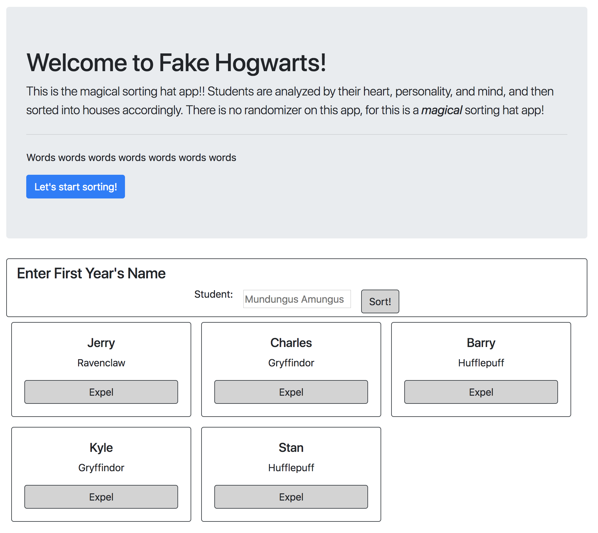

# Sorting Hat

## Description
This Harry Potter universe-themed app uses a randomizer function to randomly assign one of the Hogwarts houses to perspective new students. This app serves as practice for Bootstrap, conditional styling, and math functions in vanilla JavaScript.

## Screenshots


## How to run this project
* Use npm to install http-server in your terminal:
```sh
npm install -g http-server
```
* Run the server in your terminal
```sh
hs -p 9999
```
* Open chrome and navigate to:
```
localhost: 9999
```
